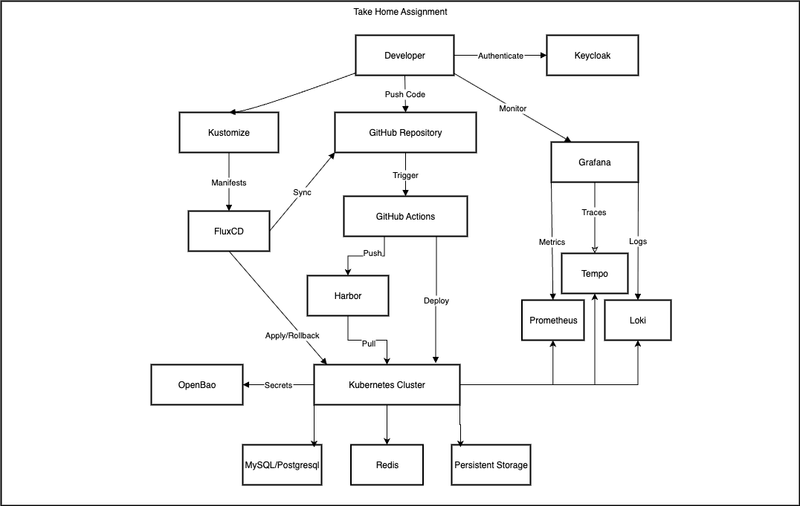

# Take Home Assignment

This document outlines the workflow for the developer experience and platform integration. The workflow leverages Keycloak for authentication, GitHub for version control and CI/CD, FluxCD for GitOps, and various Kubernetes services (OpenBao, Harbor, MySQL, Redis, Grafana, Prometheus, Loki, and Tempo) for a robust development and deployment environment.

---

## Overview

The architecture facilitates a streamlined developer experience while allowing platform engineers to manage the underlying infrastructure. Developers focus on coding, customizing manifests, and monitoring, while the platform team handles cluster provisioning and service configuration.

---

## Workflow Diagram

The above image illustrates this workflow, showing the flow from developer actions (authentication, code push, monitoring) through CI/CD and deployment, supported by the platform team's infrastructure setup.

---

## Developer Workflow

### 1. **Authentication**
- **Actor**: Developer
- **Action**: Authenticates using Keycloak, which provides secure access to the Kubernetes cluster and other services.
- **Details**: Keycloak serves as the Identity Provider (IdP) using OpenID Connect (OIDC), ensuring single sign-on (SSO) across the ecosystem.

### 2. **Code Push and Customization**
- **Actor**: Developer
- **Action**: Pushes code and customizes Kubernetes manifests using Kustomize.
- **Details**: 
  - Code and manifests are committed to a GitHub Repository.
  - Kustomize allows developers to tailor prewritten Deployments or StatefulSets to their needs (e.g., adjusting replicas or environment variables).

### 3. **CI/CD Trigger**
- **Actor**: GitHub Actions
- **Action**: Triggered by code pushes to the GitHub Repository, GitHub Actions validates the manifests.
- **Details**: The workflow ensures syntax and compatibility before proceeding with deployment.

### 4. **Deployment via FluxCD**
- **Actor**: FluxCD
- **Action**: Syncs the GitHub Repository with the Kubernetes Cluster and applies or rolls back changes.
- **Details**: 
  - FluxCD pulls manifests from the repository and deploys them to the cluster.
  - In case of failure, it supports rollback to the last stable state.

### 5. **Image Management**
- **Actor**: Developer / Kubernetes Cluster
- **Action**: Pulls container images from Harbor.
- **Details**: Harbor acts as the private image registry, authenticated via Keycloak, providing secure image storage and retrieval.

### 6. **Secrets Management**
- **Actor**: Kubernetes Cluster
- **Action**: Retrieves secrets from OpenBao.
- **Details**: OpenBao securely stores and provides secrets (e.g., database credentials) to applications running in the cluster.

### 7. **Shared Services**
- **Actor**: Kubernetes Cluster
- **Action**: Utilizes MySQL and Redis as shared services accessible to applications.
- **Details**: 
  - **MySQL**: Provides a shared relational database for application data.
  - **Redis**: Offers a shared caching layer to enhance application performance.
  - Both services are deployed within the cluster and configured for multi-application access.

### 8. **Persistent Storage**
- **Actor**: Kubernetes Cluster
- **Action**: Leverages an external storage array for persistent storage.
- **Details**: The external storage array (e.g., SAN or NAS) is integrated with Kubernetes via storage classes and PersistentVolumeClaims (PVCs), providing durable storage for stateful applications.

### 9. **Monitoring**
- **Actor**: Developer
- **Action**: Monitors application and cluster health using Grafana.
- **Details**: 
  - **Metrics**: Collected by Prometheus and visualized in Grafana.
  - **Logs**: Aggregated by Loki for log analysis.
  - **Traces**: Managed by Tempo for distributed tracing, providing end-to-end visibility.

---

## Platform Team Responsibilities

The platform team sets up and maintains the infrastructure to support the developer workflow.

### 1. **Cluster Provisioning**
- **Actor**: Platform Engineer
- **Action**: Provisions the Kubernetes Cluster on bare-metal servers using infrastructure-as-code (IaC) tools.
- **Details**: Tools like OpenTofu define the cluster configuration, with GitHub Actions automating the provisioning process.

### 2. **Service Configuration**
- **Actor**: Platform Engineer
- **Action**: Configures and deploys Base Manifests, Keycloak, OpenBao, Harbor, FluxCD, Grafana, MySQL, and Redis.
- **Details**:
  - Base Manifests that can be consumed and updated using Kustomize.
  - Keycloak is set up for authentication.
  - OpenBao manages secrets.
  - Harbor is configured as the image registry.
  - FluxCD is installed for GitOps.
  - Grafana, with Prometheus, Loki, and Tempo, is deployed for monitoring.
  - MySQL and Redis are provisioned as shared services.
  - The external storage array is integrated for persistent storage.

### 3. **Infrastructure Automation**
- **Actor**: GitHub Actions
- **Action**: Applies OpenTofu configurations to provision and update bare-metal servers.
- **Details**: Changes to the GitHub Repository trigger automated infrastructure updates.

---

## Component Interactions

- **Keycloak**: Authenticates developers and integrates with Kubernetes, Harbor, and Grafana.
- **GitHub Repository**: Central hub for code, manifests, and IaC configurations.
- **GitHub Actions**: Drives CI/CD for deployments and infrastructure provisioning.
- **FluxCD**: Ensures continuous synchronization between GitHub and Kubernetes.
- **Harbor**: Supplies container images to the cluster.
- **OpenBao**: Provides secure secret management.
- **Kubernetes Cluster**: Hosts applications, leveraging MySQL, Redis, and the external storage array.
- **Grafana**: Offers a unified dashboard for metrics (Prometheus), logs (Loki), and traces (Tempo).

## Author
### Jaco van Zyl
